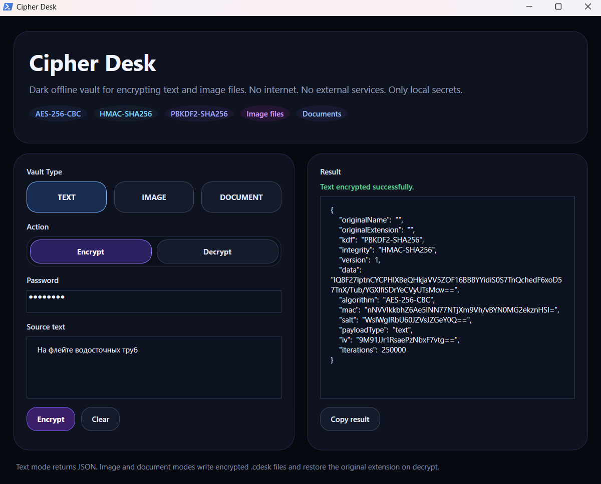
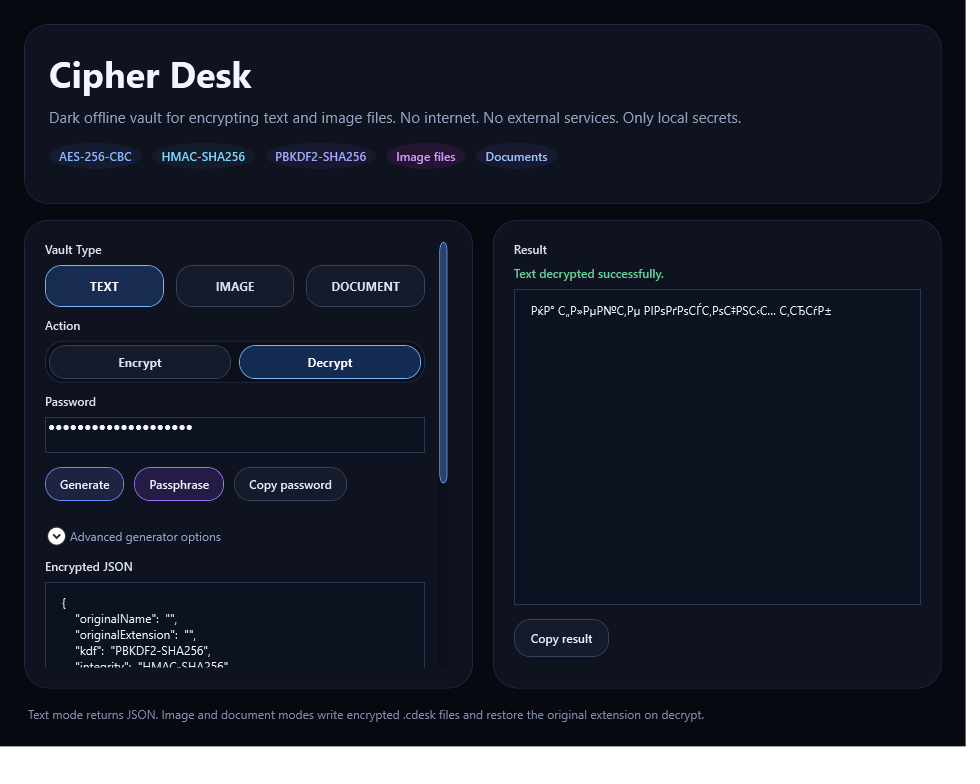
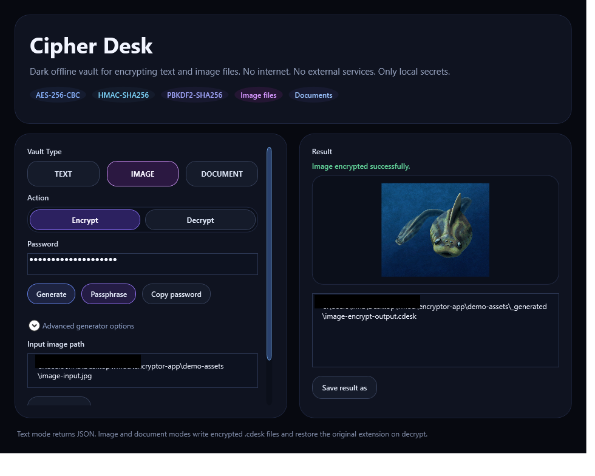
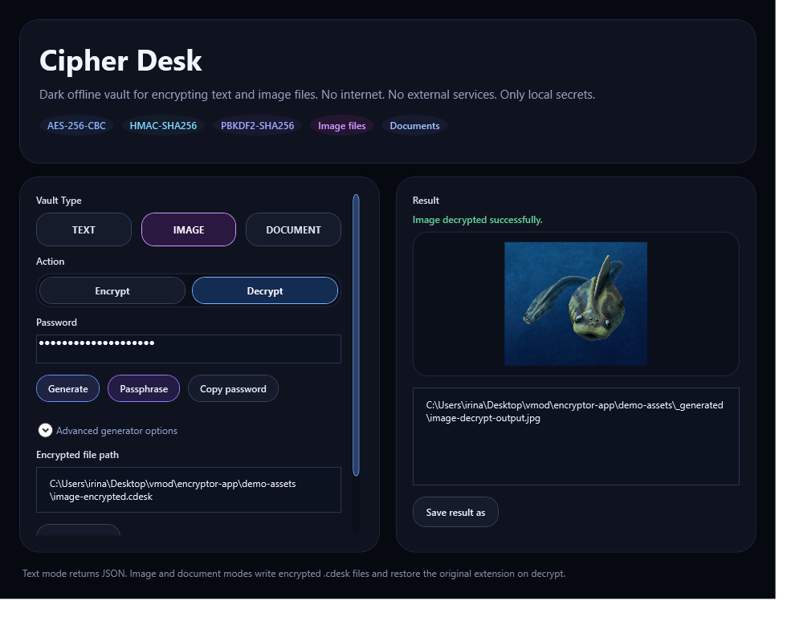
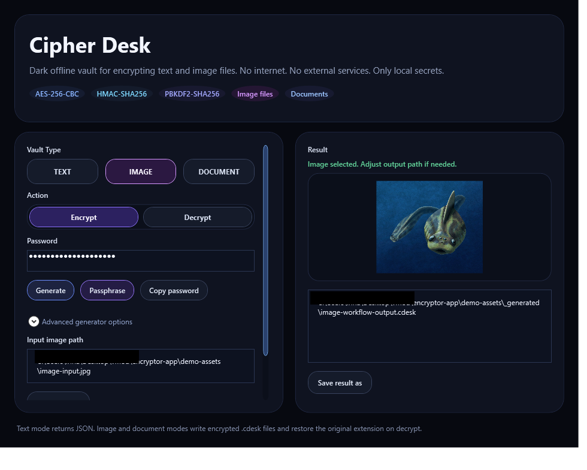
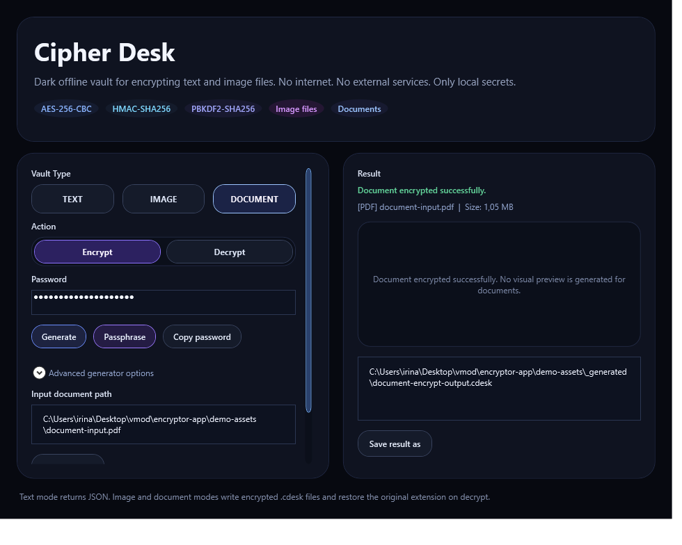
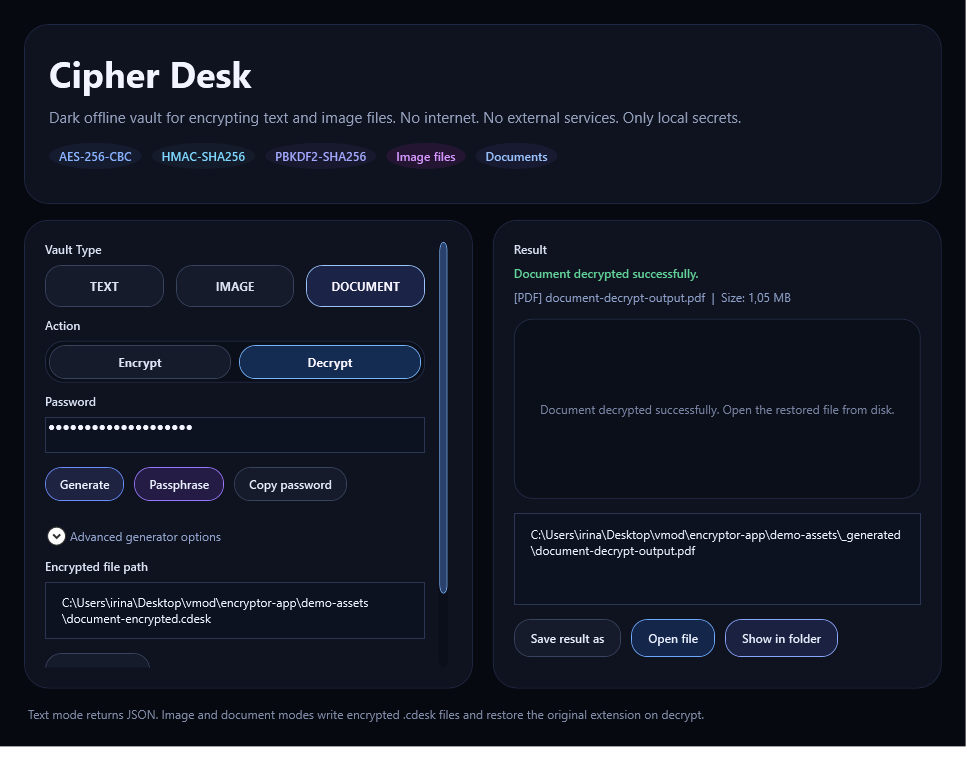
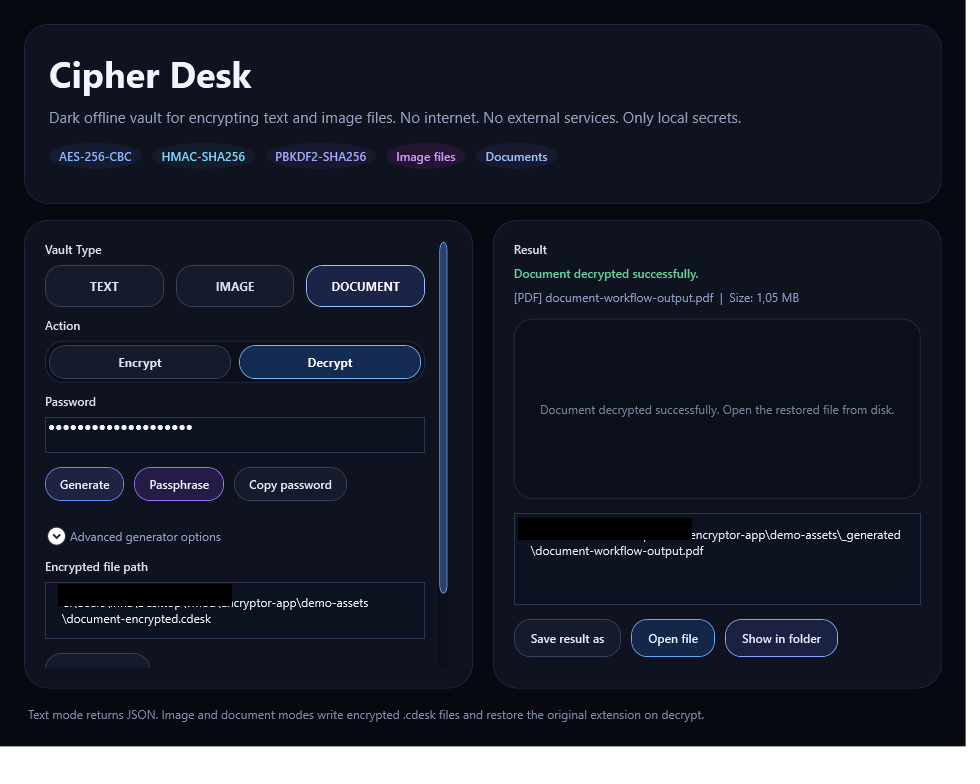
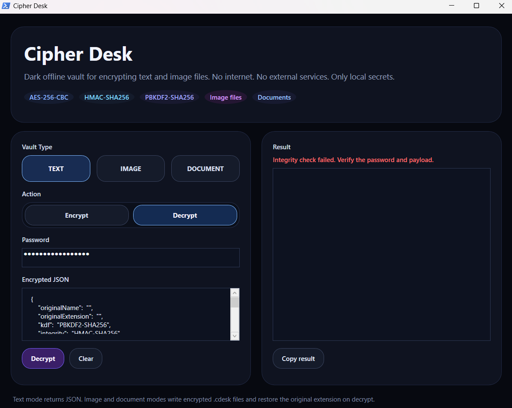

# Cipher Desk

`Cipher Desk` — desktop-приложение для Windows для локального шифрования текста, изображений и документов.

Проект работает полностью офлайн и не требует внешних сервисов.

## Кратко

- Версия: `0.2.3`
- Платформа: `Windows`
- UI: `PowerShell + WPF`
- Криптография: `AES-256-CBC` + `HMAC-SHA256` + `PBKDF2-SHA256`
- Формат файлов: `.cdesk`

## Что умеет

- шифровать текст в `JSON`
- шифровать изображения в `.cdesk`
- шифровать документы в `.cdesk`
- восстанавливать исходное расширение файлов при расшифровке
- показывать предпросмотр изображений
- открывать расшифрованный документ и его папку
- генерировать случайный пароль прямо в приложении
- генерировать passphrase из нескольких слов
- копировать пароль в буфер обмена
- настраивать длину пароля и наборы символов
- собирать portable-версию через отдельный скрипт

## Генерация Паролей

В приложении есть встроенный генератор паролей под полем `Password`.

Доступно:

- `Generate` — случайный пароль
- `Passphrase` — парольная фраза из слов
- `Copy password` — копирование текущего пароля
- выбор длины: `12`, `16`, `20`, `24`, `32`
- переключатели групп символов: `A-Z`, `a-z`, `0-9`, `!@#`

Это позволяет быстро создавать сильный пароль прямо перед шифрованием, не переключаясь в другие программы.

## Быстрый Старт

Запуск приложения:

- `CipherDeskLauncher.exe`
- `Launch-CipherDesk.cmd`
- `CipherDesk.ps1`

## Сборка Portable-Версии

Быстрый запуск:

```cmd
make-portable-release.cmd
```

Через PowerShell:

```powershell
powershell -ExecutionPolicy Bypass -File .\make-portable-release.ps1
```

С указанием папки вывода:

```powershell
powershell -ExecutionPolicy Bypass -File .\make-portable-release.ps1 -OutputRoot .\release
```

## Тестирование

Базовая самопроверка:

```powershell
powershell -ExecutionPolicy Bypass -File .\CipherDesk.ps1 -SelfTest
```

Отдельный тестовый сценарий:

```powershell
powershell -ExecutionPolicy Bypass -File .\tests\test-roundtrip.ps1
```

Ожидаемый результат:

```text
Self-test OK
```

## Документация

- [SECURITY.md](SECURITY.md) — ограничения, модель угроз и рекомендации
- [CHANGELOG.md](CHANGELOG.md) — история изменений
- [docs/file-format.md](docs/file-format.md) — описание формата `.cdesk`
- [docs/architecture.md](docs/architecture.md) — устройство приложения
- [RELEASE_NOTES_0.2.3.md](RELEASE_NOTES_0.2.3.md) — заметки к версии `0.2.3`
- [demo-assets/README.md](demo-assets/README.md) — demo-файлы для автоматического обновления скриншотов

## Обновление Скриншотов

Скрипт может автоматически пересоздать все скриншоты README на основе файлов из `demo-assets`:

```powershell
powershell -ExecutionPolicy Bypass -File .\make-screenshots.ps1
```

Сценарии лежат в [screenshot-scenarios.json](screenshot-scenarios.json), а входные demo-файлы и автоматически подготовленные артефакты находятся в [demo-assets](demo-assets/README.md).

## Скриншоты

Шифрование текста:



Расшифровка текста:



Шифрование изображения:



Расшифровка изображения:



Выбор и подготовка файла изображения:



Шифрование документа:



Расшифровка документа:



Работа с расшифрованным документом:



Ошибка расшифровки:



## Структура Репозитория

- `CipherDesk.ps1` — основное desktop-приложение
- `CipherDesk.App.ps1` — внутренняя реализация окна и orchestration-слой приложения
- `CipherDeskLauncher.cs` — исходник launcher'а
- `CipherDeskLauncher.exe` — launcher для запуска как обычной программы
- `Launch-CipherDesk.cmd` — простой локальный запуск
- `make-portable-release.ps1` — полный скрипт сборки portable-версии
- `make-portable-release.cmd` — быстрый запуск сборки
- `make-screenshots.ps1` — автоматическое обновление скриншотов
- `screenshot-scenarios.json` — список сценариев для автосъёмки
- `modules/` — функциональные модули приложения
- `tests/test-roundtrip.ps1` — тестовый сценарий
- `docs/file-format.md` — описание формата контейнера
- `docs/architecture.md` — краткая архитектура проекта

## Dev Tooling

Служебная логика для автоматических скриншотов вынесена из публичного entrypoint в отдельный внутренний слой:

- [CipherDesk.ps1](CipherDesk.ps1) — обычный пользовательский запуск и self-test
- [CipherDesk.App.ps1](CipherDesk.App.ps1) — внутренняя реализация UI и orchestration
- [make-screenshots.ps1](make-screenshots.ps1) — orchestration для пересъёмки README-скриншотов

Так основная точка входа остаётся понятной для пользователя, а технические сценарии живут отдельно от повседневного запуска приложения.

## Модульная Структура

Проект дополнительно разбит на отдельные модули по ответственности:

- [CipherDesk.Core.ps1](modules/CipherDesk.Core.ps1) — криптография, payload, text helpers и self-test
- [CipherDesk.Passwords.ps1](modules/CipherDesk.Passwords.ps1) — генерация случайных паролей и passphrase
- [CipherDesk.Files.ps1](modules/CipherDesk.Files.ps1) — file dialogs и вычисление путей для `.cdesk` и restored-файлов
- [CipherDesk.Screenshots.ps1](modules/CipherDesk.Screenshots.ps1) — служебная логика автоскриншотов
- [CipherDesk.UiHelpers.ps1](modules/CipherDesk.UiHelpers.ps1) — status, preview, file info и UI helper-функции
- [CipherDesk.ModeHandlers.ps1](modules/CipherDesk.ModeHandlers.ps1) — mode switching, run action и runtime-логика режимов

Это уменьшает размер основного app-файла и делает код проще для чтения, поддержки и дальнейшего рефакторинга.
